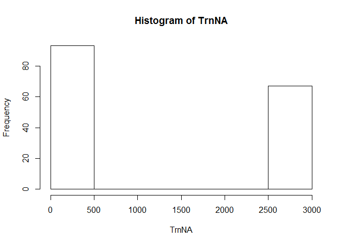
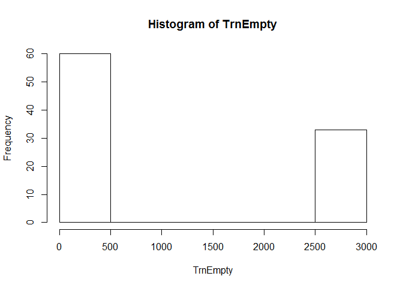

# Activity Quality From Activity Monitors
#Summary#
  The following machine learning procedure looks of qualify the correctness of workout activities based on personalized sensors.  The data was provided by Groupware and was downloaded from the links below.  This problem is one of classification and although regression models were applied, the final model selection based on class output and input data processing was Random Forest.  Given the size of the dataset both in records and features, the processing of this file is lengthy.  Some discussion of this will be covered through the write-up.  That said this model did produce acceptable performance in validation and test.  
  
##Required Packages & Data##

```r
library("caret")
```

```
## Loading required package: lattice
## Loading required package: ggplot2
```

```r
library("e1071")
library("foreach")
library("parallel")
library("doParallel")
```

```
## Loading required package: iterators
```

```r
 MLTrain<-read.csv("C:/Users/Greg/Downloads/pml-training.csv")
 MLTest<-read.csv("C:/Users/Greg/Downloads/pml-testing.csv")
```
#Feature Selection#
As is often the case, the initial lack of familiarity with the data creates hesitation on which if any fields should be omitted.  In exploratory work, it was identified that a large number of fields were overwhelmingly dominated by NA and Null values.  After creating a small exploratory data set, the fields were interrogated to percentages of NA and null values were involved.  Those fields had little to no sensor data were removed.  Initial attempts with regression models were yielding very high in-sample(in training) prediction rates. However, it appeared that some interplay of the metadata tags was boosting those responses.  All metadata was removed vice subject name and the performance of the regression models pancaked.  


```r
set.seed(10)

inVal<-createDataPartition(y=MLTrain$classe, p=0.15, list=F)
Trn<-MLTrain[inVal,]
VlTrn<-MLTrain[-inVal,]

TrnNA<-sapply(data.frame(is.na(Trn)),sum)
hist(TrnNA)
```

 

```r
Trn<-Trn[,TrnNA<1]
emptyc<-function(x){x==""}
TrnEmpty<-sapply(as.data.frame(lapply(Trn,FUN=function(x) {sapply(x,FUN=emptyc)})),sum)
hist(TrnEmpty)
```

 

```r
Trn<-Trn[,TrnEmpty<2000]
lapply(Trn, class)[lapply(Trn, class)=="factor"]
```

```
## $user_name
## [1] "factor"
## 
## $cvtd_timestamp
## [1] "factor"
## 
## $new_window
## [1] "factor"
## 
## $classe
## [1] "factor"
```

```r
summary(Trn[Trn$new_window=="yes","classe"])
```

```
##  A  B  C  D  E 
## 13  9 13  9 14
```

```r
Trn<-subset(Trn, select=-c(new_window,X,raw_timestamp_part_1,raw_timestamp_part_2,cvtd_timestamp, num_window))
```
Given the computing limits of the system employed in this analysis, a small training subset was process in the parrallel random forest model to identify important variables/features.  The top twenty most important variables were selected and the training fields were limited to those features.  K nearest neidghbor preprocessing was employeed to facititate model execution.  


```r
cl <- makePSOCKcluster(3)
clusterEvalQ(cl, library(foreach))
```

```
## [[1]]
## [1] "foreach"   "methods"   "stats"     "graphics"  "grDevices" "utils"    
## [7] "datasets"  "base"     
## 
## [[2]]
## [1] "foreach"   "methods"   "stats"     "graphics"  "grDevices" "utils"    
## [7] "datasets"  "base"     
## 
## [[3]]
## [1] "foreach"   "methods"   "stats"     "graphics"  "grDevices" "utils"    
## [7] "datasets"  "base"
```

```r
registerDoParallel(cl)

MLObj<-train(classe~., Trn, preProcess="knnImpute", method="parRF")
```

```
## Loading required package: randomForest
## randomForest 4.6-10
## Type rfNews() to see new features/changes/bug fixes.
```

```r
df<-varImp(MLObj)
rn<-rownames(df$importance[1])
subs<-c(rn[order(df$importance, decreasing=TRUE)][1:20],"classe")
inVal<-createDataPartition(y=MLTrain$classe, p=0.75, list=F)
Trn<-MLTrain[inVal,]
VlTrn<-MLTrain[-inVal,]

Trn<-subset(Trn, select=subs)

MLObj<-train(classe~., Trn, preProcess="knnImpute", method="parRF")
```
#Out of Sample Error#
The validation set was used to used to asses the sucess of the random forest fit.  Based on the ratio of aggreement to validation records, it would have an error of 1 in 100.  As a post mortem the 15% training model was run on the testing record with the same results.  

```r
nVlTrn<-VlTrn[,colnames(Trn)]
vPred<-predict(MLObj, newdata=nVlTrn)
sPred<-predict(MLObj, newdata=Trn)
summary(vPred)
```

```
##    A    B    C    D    E 
## 1394  952  850  810  898
```

```r
summary(nVlTrn$classe)
```

```
##    A    B    C    D    E 
## 1395  949  855  804  901
```

```r
sum(vPred==nVlTrn$classe)/length(nVlTrn$classe)
```

```
## [1] 0.9902
```

```r
sum(sPred==Trn$classe)/length(Trn$classe)
```

```
## [1] 1
```


```r
colnames(MLTest)
```

```
##   [1] "X"                        "user_name"               
##   [3] "raw_timestamp_part_1"     "raw_timestamp_part_2"    
##   [5] "cvtd_timestamp"           "new_window"              
##   [7] "num_window"               "roll_belt"               
##   [9] "pitch_belt"               "yaw_belt"                
##  [11] "total_accel_belt"         "kurtosis_roll_belt"      
##  [13] "kurtosis_picth_belt"      "kurtosis_yaw_belt"       
##  [15] "skewness_roll_belt"       "skewness_roll_belt.1"    
##  [17] "skewness_yaw_belt"        "max_roll_belt"           
##  [19] "max_picth_belt"           "max_yaw_belt"            
##  [21] "min_roll_belt"            "min_pitch_belt"          
##  [23] "min_yaw_belt"             "amplitude_roll_belt"     
##  [25] "amplitude_pitch_belt"     "amplitude_yaw_belt"      
##  [27] "var_total_accel_belt"     "avg_roll_belt"           
##  [29] "stddev_roll_belt"         "var_roll_belt"           
##  [31] "avg_pitch_belt"           "stddev_pitch_belt"       
##  [33] "var_pitch_belt"           "avg_yaw_belt"            
##  [35] "stddev_yaw_belt"          "var_yaw_belt"            
##  [37] "gyros_belt_x"             "gyros_belt_y"            
##  [39] "gyros_belt_z"             "accel_belt_x"            
##  [41] "accel_belt_y"             "accel_belt_z"            
##  [43] "magnet_belt_x"            "magnet_belt_y"           
##  [45] "magnet_belt_z"            "roll_arm"                
##  [47] "pitch_arm"                "yaw_arm"                 
##  [49] "total_accel_arm"          "var_accel_arm"           
##  [51] "avg_roll_arm"             "stddev_roll_arm"         
##  [53] "var_roll_arm"             "avg_pitch_arm"           
##  [55] "stddev_pitch_arm"         "var_pitch_arm"           
##  [57] "avg_yaw_arm"              "stddev_yaw_arm"          
##  [59] "var_yaw_arm"              "gyros_arm_x"             
##  [61] "gyros_arm_y"              "gyros_arm_z"             
##  [63] "accel_arm_x"              "accel_arm_y"             
##  [65] "accel_arm_z"              "magnet_arm_x"            
##  [67] "magnet_arm_y"             "magnet_arm_z"            
##  [69] "kurtosis_roll_arm"        "kurtosis_picth_arm"      
##  [71] "kurtosis_yaw_arm"         "skewness_roll_arm"       
##  [73] "skewness_pitch_arm"       "skewness_yaw_arm"        
##  [75] "max_roll_arm"             "max_picth_arm"           
##  [77] "max_yaw_arm"              "min_roll_arm"            
##  [79] "min_pitch_arm"            "min_yaw_arm"             
##  [81] "amplitude_roll_arm"       "amplitude_pitch_arm"     
##  [83] "amplitude_yaw_arm"        "roll_dumbbell"           
##  [85] "pitch_dumbbell"           "yaw_dumbbell"            
##  [87] "kurtosis_roll_dumbbell"   "kurtosis_picth_dumbbell" 
##  [89] "kurtosis_yaw_dumbbell"    "skewness_roll_dumbbell"  
##  [91] "skewness_pitch_dumbbell"  "skewness_yaw_dumbbell"   
##  [93] "max_roll_dumbbell"        "max_picth_dumbbell"      
##  [95] "max_yaw_dumbbell"         "min_roll_dumbbell"       
##  [97] "min_pitch_dumbbell"       "min_yaw_dumbbell"        
##  [99] "amplitude_roll_dumbbell"  "amplitude_pitch_dumbbell"
## [101] "amplitude_yaw_dumbbell"   "total_accel_dumbbell"    
## [103] "var_accel_dumbbell"       "avg_roll_dumbbell"       
## [105] "stddev_roll_dumbbell"     "var_roll_dumbbell"       
## [107] "avg_pitch_dumbbell"       "stddev_pitch_dumbbell"   
## [109] "var_pitch_dumbbell"       "avg_yaw_dumbbell"        
## [111] "stddev_yaw_dumbbell"      "var_yaw_dumbbell"        
## [113] "gyros_dumbbell_x"         "gyros_dumbbell_y"        
## [115] "gyros_dumbbell_z"         "accel_dumbbell_x"        
## [117] "accel_dumbbell_y"         "accel_dumbbell_z"        
## [119] "magnet_dumbbell_x"        "magnet_dumbbell_y"       
## [121] "magnet_dumbbell_z"        "roll_forearm"            
## [123] "pitch_forearm"            "yaw_forearm"             
## [125] "kurtosis_roll_forearm"    "kurtosis_picth_forearm"  
## [127] "kurtosis_yaw_forearm"     "skewness_roll_forearm"   
## [129] "skewness_pitch_forearm"   "skewness_yaw_forearm"    
## [131] "max_roll_forearm"         "max_picth_forearm"       
## [133] "max_yaw_forearm"          "min_roll_forearm"        
## [135] "min_pitch_forearm"        "min_yaw_forearm"         
## [137] "amplitude_roll_forearm"   "amplitude_pitch_forearm" 
## [139] "amplitude_yaw_forearm"    "total_accel_forearm"     
## [141] "var_accel_forearm"        "avg_roll_forearm"        
## [143] "stddev_roll_forearm"      "var_roll_forearm"        
## [145] "avg_pitch_forearm"        "stddev_pitch_forearm"    
## [147] "var_pitch_forearm"        "avg_yaw_forearm"         
## [149] "stddev_yaw_forearm"       "var_yaw_forearm"         
## [151] "gyros_forearm_x"          "gyros_forearm_y"         
## [153] "gyros_forearm_z"          "accel_forearm_x"         
## [155] "accel_forearm_y"          "accel_forearm_z"         
## [157] "magnet_forearm_x"         "magnet_forearm_y"        
## [159] "magnet_forearm_z"         "problem_id"
```

```r
nMLTest<-MLTest[,colnames(Trn)[-21]]
TPred<-predict(MLObj, newdata=nMLTest)
Submission<-summary(TPred)
```

